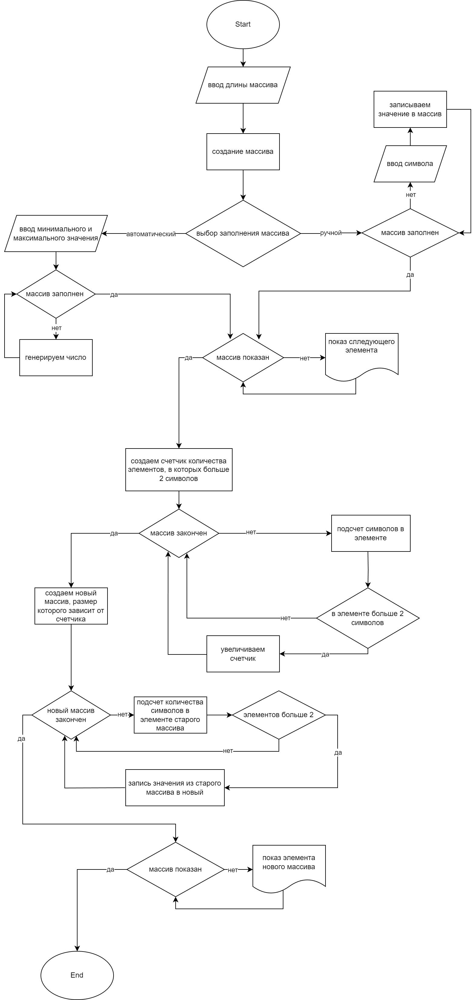

# Контрольная работа
## Основной блок. Курс разработчик

### Задача: 

Написать программу, которая из имеющегося массива строк формирует массив из строк, длина которых меньше либо равна 3 символа. Первоначальный массив можно ввести с клавиатуры, либо задать на старте выполнения алгоритма. При решение не рекомендуется пользоваться коллекциями, лучше обойтись исключительно массивами.

Визуальное представление алгоритма программы выполнено блоксхемой.
### Блоксхема
